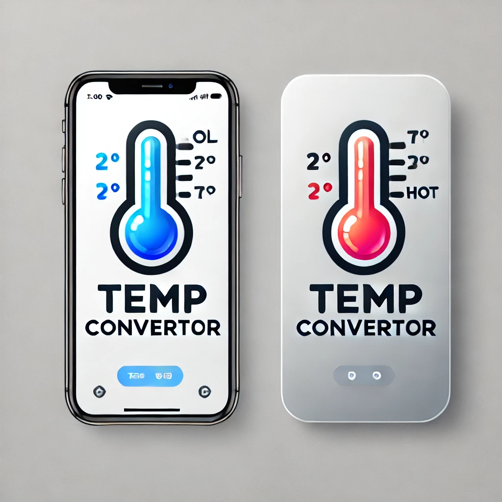
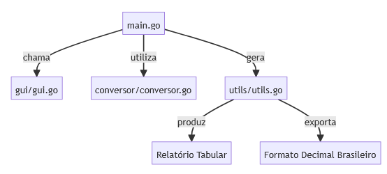

# 📂 Projeto: Conversor de Temperatura

## 🖍️ Descrição

Este projeto é um conversor de temperatura desenvolvido em Go que permite converter valores entre Celsius e Fahrenheit. Ele combina cálculos matemáticos precisos, uma interface gráfica intuitiva e relatórios detalhados para facilitar a visualização das conversões.

## 🎯 Objetivo do Projeto

O objetivo principal deste projeto é fornecer uma ferramenta prática e eficiente para realizar conversões de temperatura, além de gerar relatórios tabulares que auxiliam na compreensão dos resultados.

## 🚀 Funcionalidades

- **Conversão de Temperaturas:** Converte valores entre Celsius e Fahrenheit.
- **Interface Gráfica Intuitiva:** Captura e valida entradas do usuário.
- **Relatórios Tabulares:** Geração de tabelas detalhadas com os resultados.
- **Formatação Decimal Brasileira:** Exibe números no padrão brasileiro (vírgula como separador decimal).

## 📂 Estrutura do Projeto

Abaixo está uma visualização da estrutura do projeto:

├── conversor/
│   ├── conversor.go
│   └── conversor_test.go
├── gui/
│   ├── gui.go
│   └── gui_test.go
├── utils/
│   ├── utils.go
│   └── utils_test.go
├── go.mod
├── go.sum
├── main.go
├── README.md

## 🏆 Benefícios do Conversor

- **Precisão:** Elimina erros manuais em cálculos de conversão.
- **Eficiência:** Automatiza conversões complexas, economizando tempo.
- **Clareza:** Gera relatórios detalhados que facilitam a interpretação dos resultados.

## 🔄 Relacionamento Entre os Módulos

    A[main.go] -->|chama| B[gui/gui.go]
    A -->|utiliza| C[conversor/conversor.go]
    A -->|gera| D[utils/utils.go]
    D -->|produz| E[Relatório Tabular]
    D -->|exporta| F[Formato Decimal Brasileiro]

## ⚙️ Pré-requisitos

Antes de executar o projeto, certifique-se de que as seguintes ferramentas estão instaladas no seu sistema:

### 1. **Instale a Linguagem Go**

O projeto foi desenvolvido em Go, então é necessário ter o Go instalado. Siga as instruções abaixo para instalar:

- **Windows**:
  - Baixe o instalador oficial do Go no site: [https://golang.org/dl/](https://golang.org/dl/).
  - Execute o instalador e siga as instruções.
  - Após a instalação, verifique se o Go está configurado corretamente executando:

    go version

    A saída deve exibir a versão instalada, por exemplo:

    go version go1.23.6 windows/amd64

- **Linux/macOS**:

  - Use o gerenciador de pacotes do seu sistema para instalar o Go. Por exemplo:

    sudo apt install golang

  - Verifique a instalação com:

    go version

### 2. **Instale um Compilador C (Se Necessário)**

O Fyne, usado para a interface gráfica, pode exigir um compilador C para compilar dependências nativas (como OpenGL). Se você encontrar erros relacionados ao OpenGL, siga as instruções abaixo:

- **Windows**:
  - Instale o [TDM-GCC](https://jmeubank.github.io/tdm-gcc/) ou [MinGW-w64](http://mingw-w64.org/doku.php).
  - Após a instalação, adicione o diretório `bin` do compilador ao seu `PATH`. Por exemplo:
    - Para TDM-GCC: Adicione `C:\TDM-GCC-64\bin` ao `PATH`.
    - Para MinGW-w64: Adicione `C:\Program Files\mingw-w64\x86_64-8.1.0-posix-seh-rt_v6-rev0\mingw64\bin` ao `PATH`.

- **Verifique a Instalação**:
  Após configurar o compilador, verifique se ele está funcionando executando:

  gcc --version

  A saída deve exibir a versão instalada, por exemplo:
  gcc (TDM-1) 9.2.0

> **Nota**: Se você estiver usando o backend `software` do Fyne (configurado no código), o compilador C não será necessário.

## 🔧 Como Executar

1. Clone o repositório:

   git clone <https://github.com/IOVASCON/go_conversor.git>

2. Navegue até o diretório do projeto:

   cd go-conversor

3. Instale as dependências:

   go mod tidy

4. Execute o programa principal:

   go run main.go

## 💻 Ambiente Virtual

Ambiente virtual configurado: **Não necessário** (Go não requer ambiente virtual).

## 📦 Bibliotecas Utilizadas

As bibliotecas utilizadas no projeto incluem:

- **fyne/v2**: Interface gráfica multiplataforma.
- **golang.org/x/text**: Formatação de números no padrão brasileiro.
- **testify**: Testes unitários e asserções.

## 🚀 Tecnologias Utilizadas

As principais tecnologias incluem:

- [Go](https://golang.org/)
- [Fyne](https://fyne.io/)
- [golang.org/x/text](https://pkg.go.dev/golang.org/x/text)

## 📅 Conteúdo do Relatório

- **Temperaturas convertidas:** Tabela com valores em Celsius e Fahrenheit.
- **Formatação regional:** Resultados exibidos no padrão brasileiro.
- **Comparativo visual:** Interface gráfica para melhor experiência do usuário.

## 🚩 Tarefas

- [X] Implementar validações adicionais.
- [X] Criar interface gráfica para usuários.
- [ ] Adicionar suporte para Kelvin.
- [ ] Melhorar documentação.

## 🔹 Histórico de Lançamento

- **0.2.0**
  - ADICIONAR: Suporte para backend software.
  - CORREÇÃO: Resolver problemas relacionados ao OpenGL.
- **0.1.1**
  - CORREÇÃO: Resolver bugs na formatação decimal.
- **0.1.0**
  - MUDANÇA: Refatorar lógica de conversão.
- **0.0.1**
  - Inicializar o projeto.

## 🙏 Contribuições

Feedbacks e sugestões são sempre bem-vindos! Sinta-se à vontade para abrir [**issues**](https://github.com/seu-usuario/go-conversor/issues) ou enviar [**pull requests**](https://github.com/seu-usuario/go-conversor/pulls).

## 👥 Autor

- [@seu-usuario](https://github.com/IOVASCON)

## 🔖 Licença

Este projeto está sob a licença [MIT](https://opensource.org/licenses/MIT).
